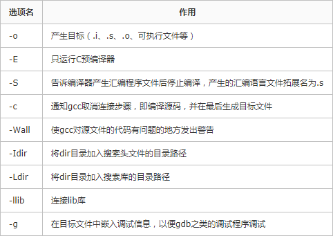

## 使用动态链接和静态链接

### 1.gcc常用命令选项



### 2.静态链接的使用

假设项目结构如下：

```shell
.
├── include
│   └── test.h
├── lib
│   ├── func1.c
│   └── func2.c
└── src
    └── main.c
```

首先，我们需要在lib目录下生成静态库文件：

```shell
$> cd lib
$> #先生成绝对目标文件
$> gcc -c func1.c -o func1.o -I../include
$> gcc -c func2.c -o func2.o -I../include
$> #然后生成静态库文件
$> ar rcs libtest.a func1.o func2.o
```

然后再src目录下生成main.c的目标文件

```shell
$> cd src
$> gcc -c main.c -o main.o
```

最后可以通过两种方式进行静态链接，方法一：

```shell
$> gcc -o main main.o ../lib/libtest.a -O -Wall -I../include
```

但我更推荐使用方法二：

```shell
$> gcc -o main main.o -L../lib -ltest -O -Wall -I../include
```


### 3.动态链接的使用

首先同样的需要在lib目录下生成动态库文件

```shell
$> gcc -c func1.c -o func1.o -I../include
$> gcc -c func2.c -o func2.o -I../include
$> #使用gcc生成动态链接库
$> gcc -shared -fPIC func1.o func2.o -o libtest.so
```

然后同样的需要在src目录下生成main.c的绝对目标文件

```shell
$> cd src
$> gcc -o main.o -c main.c -I../include 
```

最后也可以通过两种方法进行动态链接，方法一：

```shell
$> gcc -o main main.o ../lib/libtest.so
```

但是我跟推荐使用方法二：

```shell
$> gcc -o main main.o -Wl,-rpath ../lib -L../lib -ltest
```

注意这里不能够如下命令：

```shell
$> gcc -o main main.o -L../lib -ltest
```

虽然上面这一条命令会顺利执行，但是当以`./main`命令进行执行时会出错，出错提示如下：

```shell
./main: error while loading shared libraries: libtest.so: cannot open shared object file: No such file or directory
```

为此我们必须在执行gcc时主动添加`-Wl,-rpath <dirpath>`进行指出动态库的所在目录。这里另附上动态链接库搜索路径：

1. ELF可执行文件中动态段DT_PATH指定；gcc加入连接参数“-Wl,-rpath”指定动态库搜索路径，多个路径之间用冒号分隔
2. 环境变量LD_LIBRARY_PATH指定路径
3. /etc/ld.so.cache中缓存的动态库路径。通过配置文件/etc/ld.so.conf增删路径（修改后需要运行ldconfig命令）
4. /lib
5. /usr/lib